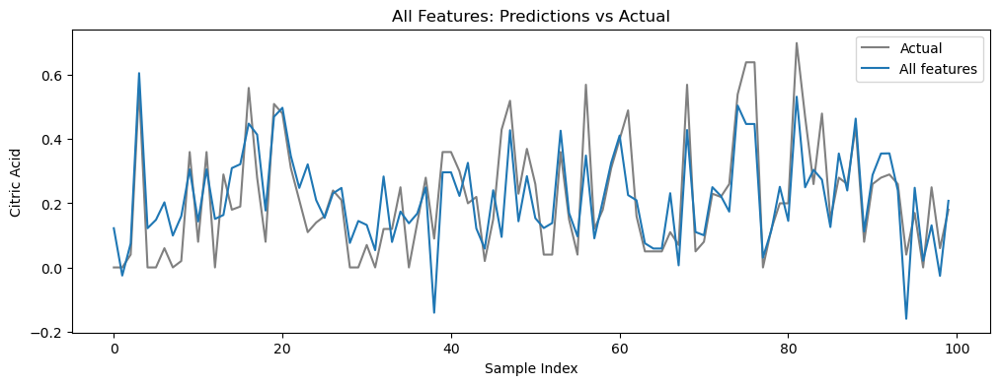

# Assignment 2A: Linear Regression for Citric Acid Prediction

## 1. Experimental Design

In this experiment, I implement linear regression from scratch using the least-squares method to predict **citric acid** content in wine samples.  
The objective is to study how different feature combinations affect model performance.

I begin with a simple baseline model using two features:
- **alcohol**
- **density**

Then, I progressively add features by evaluating which additional feature minimizes the prediction error.  
The models explored are:

- 2-feature model (baseline)
- 3-feature model (best additional feature)
- 4-feature model (best additional feature on top of the 3-feature model)
- Full model using all available features

Model performance is evaluated using **Root Mean Squared Error (RMSE)**.

---

## 2. Visualization Results

Below are visual comparisons between model predictions and actual citric acid values.

### Figure 1: 2 Features (alcohol, density)

### Figure 2: 3 Features (alcohol, density, volatile acidity)

### Figure 3: 4 Features (alcohol, density, volatile acidity, fixed acidity)

### Figure 4: All Features

---

## 3. Results Table

| Model      | Features                                          | Error (RMSE) |
| ---------- | ------------------------------------------------- | ------------ |
| Model 1    | alcohol, density                                  | 0.1686       |
| Model 2    | alcohol, density, volatile acidity                | 0.132040     |
| Model 3    | alcohol, density, volatile acidity, fixed acidity | 0.124159     |
| Full Model | all features                                      | 0.105519     |

---

## 4. Discussion

### Which features are most important for predicting citric acid?

From the results table, alcohol and density form a reasonable baseline model, but their predictive power is limited (error ≈ 0.1686). When volatile acidity is added as a third feature, the error drops significantly to approximately 0.1320, indicating that volatile acidity is a highly informative feature for predicting citric acid. Adding fixed acidity as the fourth feature further reduces the error to 0.1242, showing that it also contributes useful information, although the improvement is smaller compared to volatile acidity. Overall, volatile acidity appears to be the most important additional feature beyond alcohol and density, followed by fixed acidity.

---

### Does adding more features always improve the model?

In this experiment, adding more features does lead to a lower training error, as shown by the gradual decrease in error from the 2-feature model to the full-feature model. However, the magnitude of improvement diminishes as more features are added. For example, adding volatile acidity yields a large improvement, while adding fixed acidity results in a smaller gain. This suggests that while additional features can improve performance, not all features contribute equally, and beyond a certain point the benefit of adding more features may be marginal. In practice, adding too many features could also increase the risk of overfitting.

---

### What did you learn from this exercise?

This exercise demonstrates how feature selection plays a crucial role in linear regression performance. A small number of well-chosen features can significantly improve predictions compared to a simple baseline model. It also highlights the importance of systematically evaluating feature combinations rather than assuming that more features automatically lead to better models. Finally, implementing linear regression from scratch helped reinforce the understanding of least-squares optimization, error measurement, and the relationship between model complexity and predictive performance.
